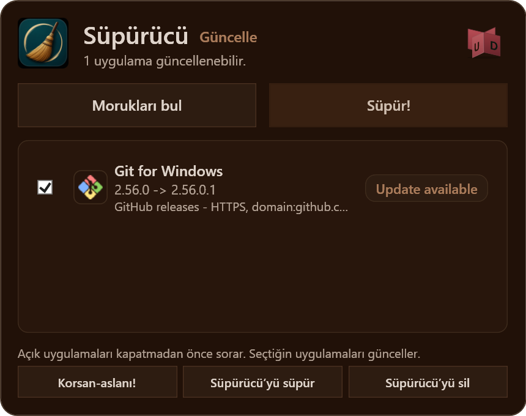
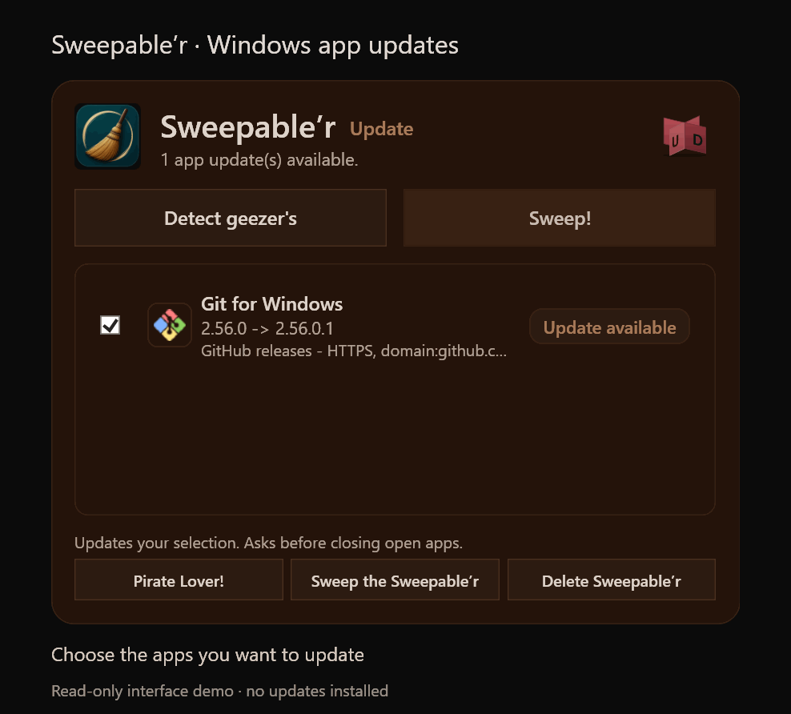

<h1 align="center">Süpürücü · Sweepable’r</h1>

Hangi Windows uygulamalarını güncelleyeceğini tek pencereden seç.

WinGet · Chocolatey · Scoop · Desteklenen resmî yükleyiciler

<a href="https://github.com/27-coder/Sweepabler/releases/latest"><strong>↓ Windows x64 sürümünü indir</strong></a>

Türkçe · <a href="README.md">English</a> · Ücretsiz ve açık kaynak

Süpürücü, eski uygulamaları bulur ve seçtiklerini günceller. İngilizce adı **Sweepable’r**, Able’r ailesinin ilk ürünü.

## Hemen dene

1. [Son Windows sürümünü](https://github.com/27-coder/Sweepabler/releases/latest) aç, **Windows x64 ZIP** dosyasını indir ve çıkar.
2. `Süpürücü.exe` dosyasını çalıştır, **Turkish** veya **English** seç ve ilk hazırlığın tamamlanmasını bekle.
3. **Morukları bul** ile tara, güncellemek istediğin uygulamaları seç ve **Süpür!** düğmesine bas.

İlk açılışta yönetici izni ister ve eksik WinGet, Git, Chocolatey ve Scoop araçlarını hazırlar. EXE henüz imzalı olmadığı için Windows uyarısı görebilirsin. Ayrıntılar [Çalıştırmak](#çalıştırmak) bölümünde.

## 20 saniyede arayüz

Ekran görüntüsü ve demo, kurulu uygulama sürümleri salt okunur biçimde kontrol edilerek gerçek uygulama arayüzünden hazırlandı. Demo seçim ve gardırop geçişlerini gösterir; hiçbir güncelleme kurulmadı. **Sil, Yama ve Yedekle geliştirme önizlemeleridir**; işlem düğmeleri henüz etkin değildir. Demo İngilizce arayüzü gösterir.

## Neler yapıyor?

- WinGet, Chocolatey, Scoop ve resmî indirme kaynaklarından oluşan katalog üzerinden güncelleme bulur.
- Doğrudan indirmelerde aynı anda üç yükleyiciye kadar indirir. Küçük indirmeler önce başlar; büyükler, küçük işler bitene kadar yavaşlar. Kurulumlar tek tek yapılır. Paket yöneticileri kendi indirmelerini yönetir.
- Python, Anaconda ve Miniconda gibi ilişkili uygulamaları birlikte gösterir. Sürümleri ve seçimleri ayrı kalır.
- **Korsan-aslanı!** ile seçtiğin uygulamaları güncelleme dışında tutar.
- İndirilen yükleyicileri kontrol eder ve güncelleme geçmişini bilgisayarında saklar.
- **Süpürücü’yü süpür** düğmesiyle bu depodan kendini günceller.

Türkçe ve İngilizce kullanılabilir. Küçük bir süpürge yardımcısı da var; taşıyabilir, boyutunu değiştirebilir veya kapatabilirsin.

Sağ üstteki küçük kırmızı gardıroba tıklayarak **Güncelle → Sil → Yama → Yedekle** alanları arasında geçiş yapabilirsin. Güncelle alanı mevcut güncelleme düğmelerini korur. Sil, Yama ve Yedekle alanları şimdilik planlanan özellikleri gösterir; işlem düğmeleri etkin değildir.

## Çalıştırmak

**Windows x64 ZIP** dosyasını [son sürüm sayfasından](https://github.com/27-coder/Sweepabler/releases/latest) indir, çıkar ve `Süpürücü.exe` dosyasını aç.

İlk açılışta **Turkish** veya **English** seç. Hazırlık, eksik WinGet, Git, Chocolatey ve Scoop araçlarını kurup kontrol eder; ardından uygulama açılır. Dili daha sonra alttaki **Language** menüsünden değiştirebilirsin.

**Morukları bul** ile tara, güncellemek istediklerini seç ve **Süpür!** düğmesine bas. Açık bir uygulamayı zorla kapatmadan önce onay ister; kabul etmeden önce çalışmalarını kaydet. Discord, güncelleme ve yeniden açılma davranışı nedeniyle kapsam dışında.

**Morukları bul**, geliştirme ön sürümleri dahil bu depoda Süpürücü için de güncelleme arar. Süpürücü normal uygulama listesine eklenmez; doğrulanmış daha yeni bir sürüm varsa **Süpürücü’yü süpür** yazısı yeşile döner. Bu düğmeye tıklayınca indirme doğrulanır, uygulama kapatılıp çalışan kopya değiştirilir ve yeniden açılır. **Süpürücü’yü sil** onaydan sonra o taşınabilir EXE’yi kaldırır; kayıtlı veriler ve kurulu araçlar kalır.

Mevcut sürüm **1.2.5**. Geliştirme devam ediyor. EXE henüz imzalı olmadığı için açarken Windows uyarısı görebilirsin.

## Sırada ne var?

Daha fazla uygulama desteği, yedekleme, temizlik önizlemesi, dosya parçalama ve Copilot ya da Edge gibi Windows bileşenleri için seçenekler. Bunlar henüz uygulamada yok.

## Neden Süpürücü?

Çoğumuz Windows’la başladık. Yıllar içinde işlerimiz, oyunlarımız, araçlarımız ve alıştığımız küçük şeylerle kendi düzenimizi kurduk. Linux veya macOS’a geçmek güzel geliyor ama bütün o ortamı taşımak başlı başına bir iş.

Süpürücü, Windows’ta kalanlar için. O düzende kullandığın uygulamaları güncel tutmakla başlıyor.

## Kaynak ve veriler

Süpürücü WPF ve .NET 10 kullanır. Uygulama kodu [src/Sweepabler](src/Sweepabler) içinde. Ayarlar, geçmiş ve indirilen dosyalar `%LOCALAPPDATA%\Supurucu` altında tutulur. Hesap ya da arka plan servisi yok.

Kaynak kod [MIT lisansıyla](LICENSE) açık. Katkılara da açık.

Geliştiriciler: [27-coder](https://github.com/27-coder) ve [umutkkgz](https://github.com/umutkkgz).
